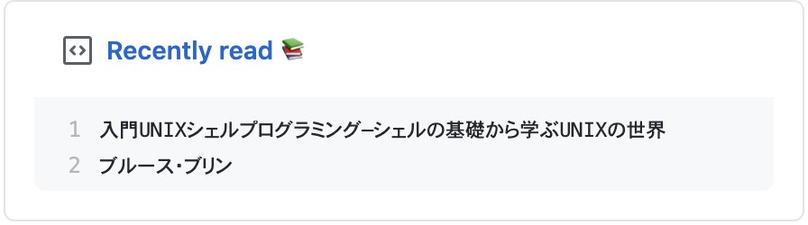

# Recently read :books:

## Overview
Fetch latest read book from booklog and write it to gist.

## Setup

1. Create a new GitHub Gist (https://gist.github.com/)
2. Create a token with the `gist` and `repo` scope and copy it.(https://github.com/settings/tokens/new)

3. Fork this repo
4. Go to the repo **Settings > Secrets**
5. Add the following environment variables.
   - GH_TOKEN: The GitHub token generated above.
   - GIST_ID : The Gist id that are updated.
   - BOOKLOG_USER_ID: Your booklog user id.